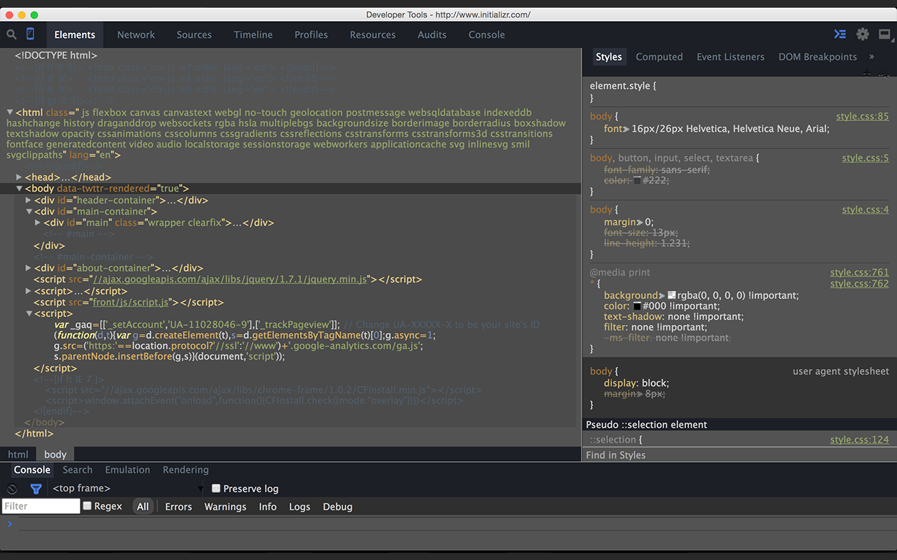
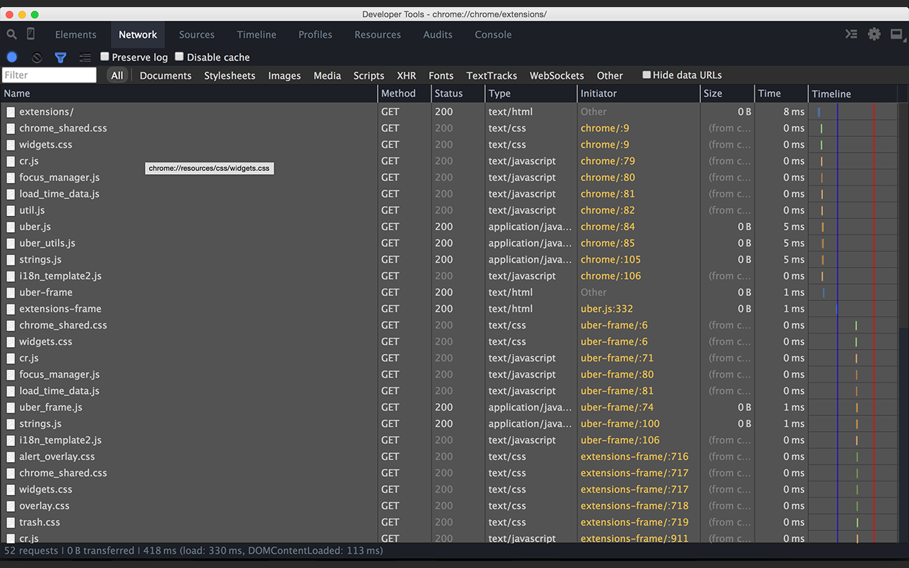
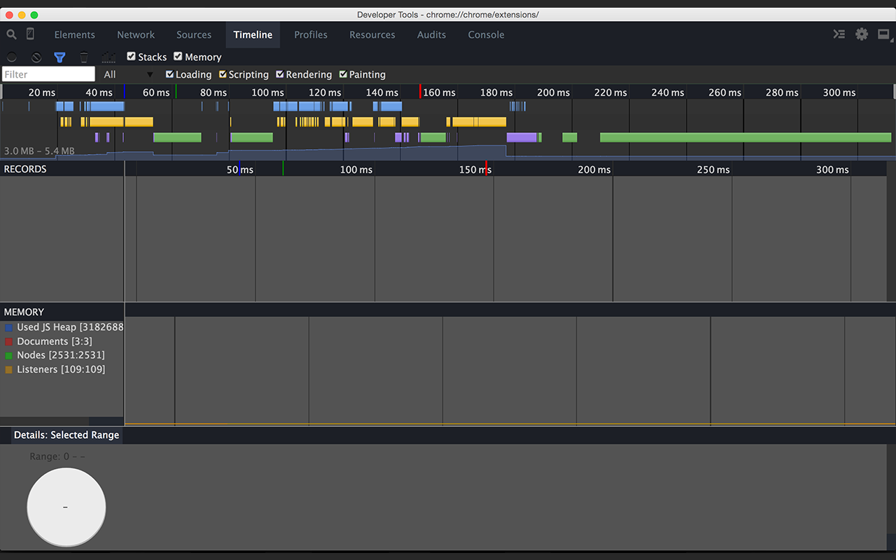

Chrome DevTools Dark Theme
===============================

A devtools theme extension using the new API











### Usage:

1. Enable DevTools experiments at: `chrome://flags/#enable-devtools-experiments`

2. Relaunch Chrome, then open DevTools, open `Settings > Experiments`, and toggle *Allow UI themes* experiment.

3. Easily Install this theme extension here: https://chrome.google.com/webstore/detail/devtools-theme-twilight-s/bpbplipacldfdfgapibcmjfpabnamoia?hl=en&gl=US

4. Read this:  https://code.google.com/p/chromium/issues/detail?id=318566#c33


# A few ways to make your own theme

Use the format of this repo to make your own devtools theme, just customize the `styles.css` file and edit the manifest.json file accordingly.

Then publish to the web store. Please add ["devtools theme"](https://chrome.google.com/webstore/search-extensions/devtools%20theme) to the name so people can easily find them!

Take a look at what's happening at [zero-base-themes](https://github.com/mauricecruz/zero-base-themes), which is creating a platform for DevTools theming.


## Yeoman Generator for Chrome DevTools Theme

You can also use Yeoman to easily create new themes: https://github.com/zenorocha/generator-devtools-theme

> A Yeoman Generator that provides a functional boilerplate to easily create
> custom Chrome DevTools Themes via Chrome Extensions.


### Getting started

1. Install using NPM:

    ```sh
    $ [sudo] npm install -g generator-devtools-theme
    ```

2. Scaffold your new project:

    ```sh
    $ yo devtools-theme
    ```

3. Start writing your custom Chrome DevTools Theme.

4. Publish it on [Chrome Web Store](https://chrome.google.com/webstore/)!

### Structure

The basic structure of the project is given in the following way.

```
.
├── .editorconfig
├── devtools.html
├── devtools.js
└── styles.css
```
